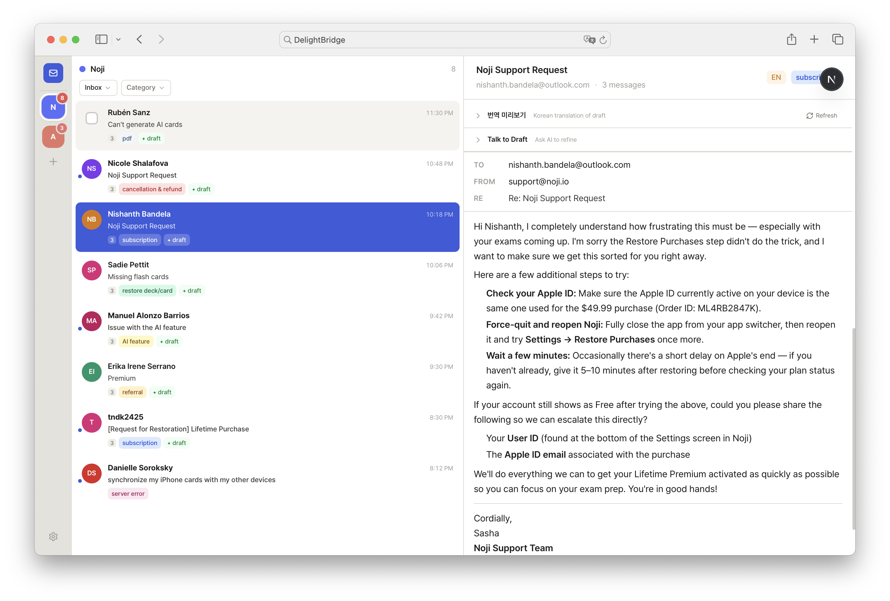

# DelightBridge

DelightBridge is an internal support workspace for handling multiple Gmail inboxes in one place, generating AI drafts from service-specific documents, and collaborating with role-based access.



## What Works Today

- 3-column support inbox UI (services, thread list, detail editor)
- AI draft generation, Talk-to-Draft refinement, Korean translation
- Service/category/document/signature management backed by DB
- Google OAuth login + session-gated pages and API routes
- Workspace member allowlist with permissions (View/Edit/Send/Admin)
- Service onboarding via `서비스 추가 + 연결` (create service and enter Gmail OAuth immediately)
- Gmail API send endpoint wired to single/bulk send actions (draft attachment send is not yet included)
- Gmail sync endpoints for full/incremental import + Vercel cron incremental sync

## Core Concepts

- App user authentication and service Gmail connection are separate concepts.
- App access is controlled by `ADMIN_EMAILS` and `workspace_members` allowlist.
- Each service stores one sender email, automatically synced from connected Gmail OAuth profile.

## Local Development

### 1) Install

```bash
pnpm install
```

### 2) Configure `.env.local`

```bash
ANTHROPIC_API_KEY=sk-ant-...
DATABASE_URL=postgresql://...
GOOGLE_CLIENT_ID=...
GOOGLE_CLIENT_SECRET=...
AUTH_SECRET=...
ADMIN_EMAILS=peter@delightroom.com
CRON_SECRET=your-random-secret
```

### 3) Push DB schema

```bash
pnpm db:push
```

### 4) Run

```bash
pnpm dev
```

Open `http://localhost:3000`.

## OAuth Setup Notes

- Google OAuth redirect URI must include `http://localhost:3000/api/auth/callback/google`.
- Service Gmail connection flow also uses `http://localhost:3000/api/services/oauth/callback`.
- To allow a new teammate to sign in, add them in `Settings > 권한 관리` (or keep them in `ADMIN_EMAILS`).

## Gmail Sync Notes

- Manual sync (admin only): `POST /api/services/:id/sync?mode=full` for full import, `POST /api/services/:id/sync` for incremental import.
- Automatic sync: Vercel cron calls `GET /api/cron/sync-gmail` every 5 minutes.
- Set `CRON_SECRET` in Vercel and send it as `Authorization: Bearer <CRON_SECRET>` (or `x-cron-secret`) when invoking the cron endpoint manually.
- Recommended rollout: run one full sync right after connecting each service, then rely on incremental cron sync.
- In `Settings > 서비스 관리`, admins can trigger `지금 동기화` (incremental) or `전체 동기화` (full) and see the latest sync result logs.

## Commands

```bash
pnpm dev
pnpm lint
pnpm build
pnpm db:push
```
